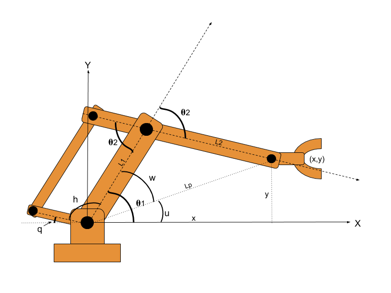
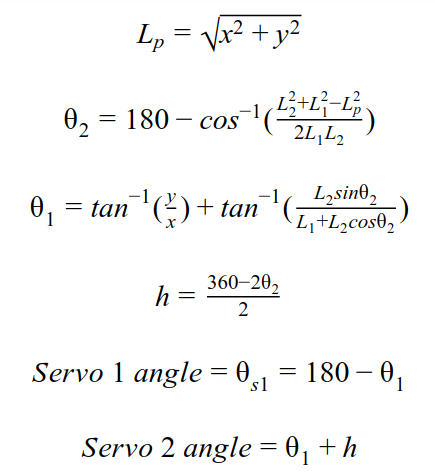

# eezy-control
Arduino code with inverse kinematics to control an MK2 robotic arm.

It turned out to be quite difficult to find the kinematic equations describing the motion of this arm. Luckily my friend, Preston Tran is the genius who created the mathematics behind this code. The link to 3D print all the parts are here: https://www.thingiverse.com/thing:1454048

We used a DFRobot Romeo v1 for control.

# The Robotic Arm

The special feature of this arm is that the end effector will stay horizontal as the arm moves in any direction. This stabilization is mechanical and does not rely on an additional motor for doing so. 

# The Equations
This is probably what most are interested in, if you are stumbling around the internet for these equations.. I couldn't find a way to embed equations in Markdown so here is a screenshot of them instead :p

